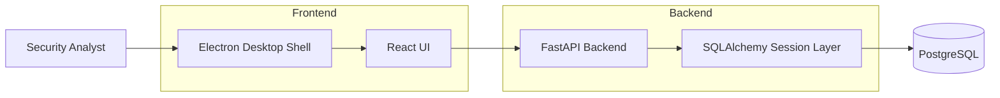

# Architecture

LogShield Phase 1 uses a split local-desktop architecture:

- Electron hosts the desktop shell.
- React + Vite renders the user interface.
- FastAPI serves backend endpoints and future business logic.
- SQLAlchemy manages ORM access to PostgreSQL.
- PostgreSQL stores logs and alerts.

## Phase 1 Design Goals

- Establish a scalable directory structure.
- Keep detection logic out of the foundation layer.
- Make API contracts and database models explicit early.
- Keep desktop UI and backend integration decoupled through Axios and a small service layer.

## Planned Expansion

Future phases can add collectors, parsers, websocket streaming, detection engines, and alert workflow modules without restructuring the foundation.
